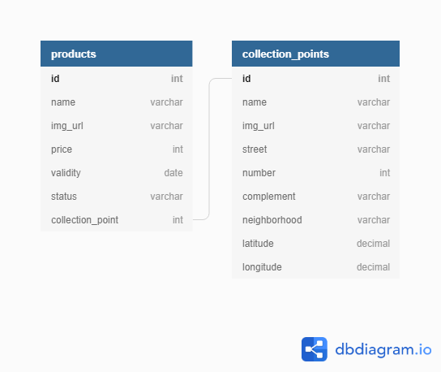

# rangory
App do Desafio Be Growth (2° Etapa).

## Requisitos
### Funcionais
* Para empresas de alimentação
  * Adicionar os produtos que estão prestes a vencer
    * data de validade
    * local de coleta
* Para os entregadores
  * Receber a demanda de busca desses produtos
  * podendo escolher quais serão os produtos que ele vai recolher
  
### Não funcionais
* Utilizar banco de dados
* Separar as aplicações de Back-End e Front-End
* Utilizar MVC
* Fazer a aplicação utilizando Node

## Modelagem

## Diretórios importantes
* Back-end (server)
  * src/models: possui as migrations, arquivo de conexão com o banco de dados (connection.ts) e o banco de dados sqlite;
  * src/controllers: gerenciamento (crud) das entidades CollectionPoints (pontos de coleta) e ProductsController (produtos);
* Front-end (web)
  * src/pages: páginas da aplicação separadas por pasta, sendo que cada pasta possui um arquivo de estilização (CSS) e outro .tsx de sintaxe JSX, que é uma extensão de sintaxe para JavaScript que é usado com o React para descrever como a UI deveria parecer.

## Tecnologias utilizadas
* Linguagem
  * typescript - JavaScript com tipagem e alguns outros recursos;
* Back-end
  * NodeJS - interpretador de JavaScript assíncrono orientado a eventos;
  * Express - framework mínimo e flexível que fornece um conjunto robusto de recursos para aplicativos web e móvel;
* Persistência
  * Knex - SQL query builder projetado para ser flexível, portátil e divertido de usar;
  * sqlite3 - SQL database engine pequeno, rápido, independente, de alta fiabilidade e completo;
* Front-end
  * ReactJS - biblioteca JavaScript de código aberto com foco em criar interfaces de usuário em páginas web;
  * axios - cliente HTTP baseado em Promise para navegador e node.js.

## App on
### Server side
* npm install
* npm run dev
* **extra** atualizando pacotes obsoletos do packeg.json: ncu / ncu -u

### Front side (web folder)
* npm install
* npm start
